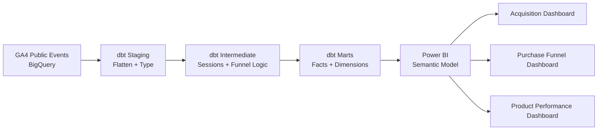
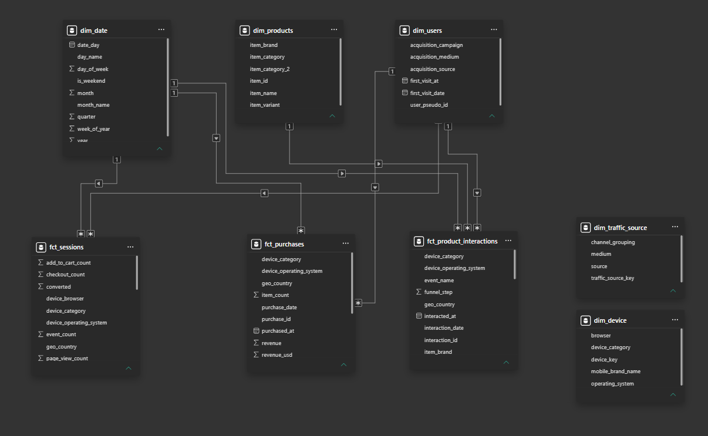
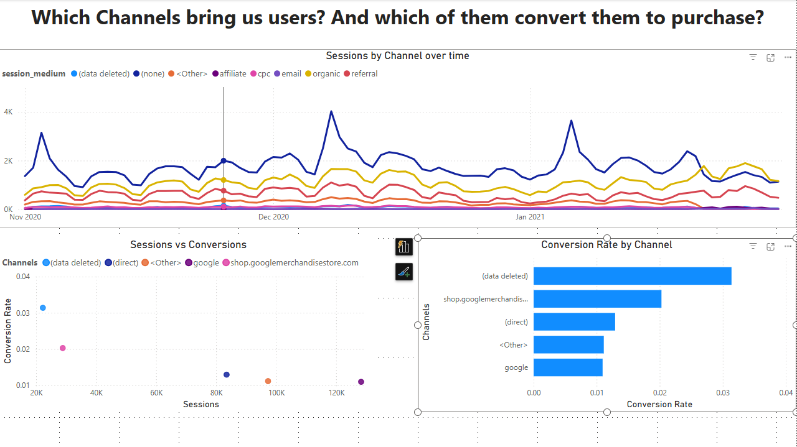
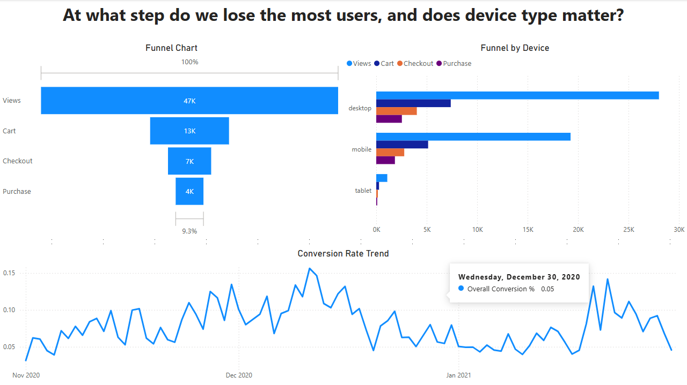
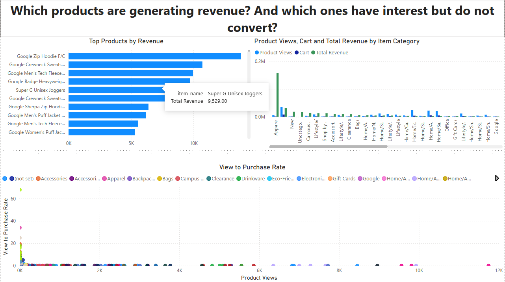

# GA4 eCommerce Analytics Engineering

**BigQuery · dbt Core · BEAM Dimensional Modeling · Power BI**

An end-to-end analytics engineering portfolio project that transforms nested Google Analytics 4 ecommerce events from the Google Merchandise Store public BigQuery dataset into documented and business-ready analytics marts for acquisition, funnel, and product analysis.

> **Project status — v0.1.0:** The dbt implementation was recovered from an earlier project pass and organized into a reproducible portfolio repository. The Power BI semantic model and three business-question dashboards have been rebuilt and documented. Final dbt re-validation, KPI reconciliation, dashboard refinement, and validated business findings remain in progress. 

---

## Business Problem

The Google Merchandise Store exports raw Google Analytics 4 events into BigQuery.

Although the dataset contains valuable ecommerce behavior, the raw GA4 export is difficult to use directly for analytics because:

* data is stored at event grain;
* important attributes are nested inside structures such as `event_params` and `items`;
* sessions have to be reconstructed from individual events;
* product information is embedded inside event-level item arrays;
* raw tables are not designed for direct BI consumption;
* ad-hoc SQL can result in inconsistent metric definitions.

The goal of this project is to create a reusable analytics layer that transforms the raw GA4 events into governed fact and dimension tables that can consistently answer the business's core questions.

The project is anchored to three business questions:

1. **Acquisition:** Which channels drive sessions, and which of those sessions convert?
2. **Funnel:** Where do users drop off between product view, cart, checkout, and purchase?
3. **Product:** Which products receive strong interest but weak purchase conversion?

Every major modeling and dashboard decision in the project traces back to one or more of these questions.

---

## Architecture



The project follows a layered analytics engineering workflow:

```text
Raw GA4 Events
      ↓
Data Exploration
      ↓
BEAM Dimensional Design
      ↓
dbt Staging
      ↓
dbt Intermediate
      ↓
dbt Marts
      ↓
Power BI Semantic Model
      ↓
Business Dashboards
```

### dbt Layers

| Layer          | Purpose                                                                               | Materialization |
| -------------- | ------------------------------------------------------------------------------------- | --------------- |
| `staging`      | Flatten GA4 structures, rename fields, cast types, and expose reusable source columns | Views           |
| `intermediate` | Reconstruct sessions, join reusable entities, and apply funnel/business logic         | Views           |
| `marts`        | Create business-facing fact and dimension tables for analytics                        | Tables          |

Keeping source cleanup, reusable business logic, and reporting models in separate layers makes the project easier to understand, test, and maintain.

---

## Dataset

**Source**

```text
bigquery-public-data.ga4_obfuscated_sample_ecommerce
```

The project uses Google's public Google Merchandise Store GA4 ecommerce dataset in BigQuery.

The sample covers:

```text
2020-11-01 → 2021-01-31
```

GA4 stores each day of events in a separate table:

```text
events_YYYYMMDD
```

The daily tables are queried together using:

```text
events_*
```

Important nested structures include:

* `event_params` — GA4 event parameters stored as key-value pairs;
* `items` — product-level information associated with ecommerce events;
* `device` — device and browser attributes;
* `geo` — geographic attributes;
* `traffic_source` — first-touch acquisition attributes;
* `ecommerce` — transaction-level ecommerce metrics.

The raw GA4 data is **not copied into this repository**. dbt reads directly from the public BigQuery dataset.

Because this is an obfuscated public sample, some identifiers and attributes may contain nulls, placeholders, `<Other>`, or other anonymized values.

---

## Data Exploration

Before dimensional modeling, the raw dataset is profiled using SQL queries in the [`analyses/`](analyses/) directory.

| Analysis                                                          | Purpose                                        |
| ----------------------------------------------------------------- | ---------------------------------------------- |
| [`01_dataset_profile.sql`](analyses/01_dataset_profile.sql)       | Profile dataset size, date coverage, and users |
| [`02_event_distribution.sql`](analyses/02_event_distribution.sql) | Review GA4 event types and frequency           |
| [`03_funnel_baseline.sql`](analyses/03_funnel_baseline.sql)       | Establish baseline funnel counts               |
| [`04_mart_sanity_checks.sql`](analyses/04_mart_sanity_checks.sql) | Validate final marts and key metrics           |

These analyses provide checkpoints for comparing the transformed dbt models with the underlying GA4 data.

---

## Dimensional Modeling

The dimensional model was designed using **Business Event Analysis & Modeling (BEAM)** before implementing the dbt transformations.

The model separates three business processes because each operates at a different analytical grain.

### Fact Tables

| Model                      | Grain                              | Primary Use                          |
| -------------------------- | ---------------------------------- | ------------------------------------ |
| `fct_sessions`             | One reconstructed GA4 session      | Acquisition and session conversion   |
| `fct_product_interactions` | One item per product funnel event  | Funnel analysis and product behavior |
| `fct_purchases`            | One completed purchase transaction | Revenue and transaction analysis     |

### Dimension Tables

| Model                | Grain                                                              |
| -------------------- | ------------------------------------------------------------------ |
| `dim_users`          | One row per `user_pseudo_id`                                       |
| `dim_products`       | One row per product                                                |
| `dim_date`           | One row per calendar date                                          |
| `dim_device`         | One row per unique device / operating system / browser combination |
| `dim_traffic_source` | One row per source / medium combination                            |

Shared dimensions provide consistent slicing across business processes where the dimension grain and available fact keys are compatible.

For the detailed BEAM workshop, business-event definitions, table grains, source mappings, and modeling decisions, see:

[`docs/03_beam_and_data_model.md`](docs/03_beam_and_data_model.md)

---

## Core Business Logic

### Session Reconstruction

GA4 does not export a ready-made sessions table.

Sessions are reconstructed using the combination of:

```text
user_pseudo_id + ga_session_id
```

Events belonging to the same session are aggregated into `fct_sessions`.

The resulting session fact includes metrics such as:

* session start and end;
* session duration;
* page views;
* product views;
* add-to-cart events;
* checkout events;
* purchases;
* engagement;
* session-level traffic attribution;
* conversion flag.

A session is considered converted when it contains at least one purchase event.

---

### Purchase Funnel

The modeled ecommerce funnel follows four GA4 events:

```text
View Item
    ↓
Add to Cart
    ↓
Begin Checkout
    ↓
Purchase
```

These events are consolidated into `fct_product_interactions`, where each row represents one item within one funnel event and each event type receives an ordered funnel step.

This structure supports funnel analysis across attributes such as:

* product;
* device;
* date;
* user;
* traffic attributes.

---

### Traffic Attribution

The model distinguishes two attribution concepts.

#### Session-Level Attribution

```text
session_source
session_medium
session_campaign
```

These fields describe where a specific session originated and are appropriate for session-level channel-performance analysis.

#### First-Touch User Acquisition

```text
traffic_source
traffic_medium
traffic_campaign
```

These fields describe how the user was originally acquired.

The distinction matters because a user may originally arrive through one source and later return through another.

---

## Power BI

Power BI consumes the dbt production marts and provides the business-facing analytics layer.

The report contains three pages aligned directly to the project's business questions:

1. Acquisition Performance
2. Purchase Funnel
3. Product Performance

The working `.pbix` report is kept locally and intentionally excluded from Git. Screenshots and DAX logic are versioned in the repository instead.

---

## Power BI Semantic Model

The current Power BI semantic model uses:

* `dim_users`
* `dim_date`
* `dim_products`

as one-to-many filtering dimensions for the applicable fact tables.

`dim_device` and `dim_traffic_source` remain disconnected in the current Power BI model because their dimensional grains are more granular than the denormalized fields currently carried by the fact tables.

For example:

* `dim_device` is defined by a device / operating system / browser combination rather than `device_category` alone;
* `dim_traffic_source` is defined by source / medium rather than `source` alone.

Creating relationships using only those lower-grain attributes would introduce many-to-many relationships.

Device and traffic analysis therefore currently uses corresponding attributes directly from the relevant fact tables.



---

## DAX Measures

The Power BI measures are documented separately from the binary `.pbix` report:

[`powerbi/measures.dax`](powerbi/measures.dax)

The current measure file includes calculations supporting the three dashboard areas.

### Acquisition

* Conversion Rate

### Purchase Funnel

* Step 1 Views
* Step 2 Cart
* Step 3 Checkout
* Step 4 Purchase
* Cart to View %
* Checkout to Cart %
* Purchase to Checkout %
* Overall Conversion %

### Product Performance

* Product Views
* Product Purchases
* View to Purchase Rate
* Total Revenue

Keeping these calculations in a text-based `.dax` file makes important reporting logic inspectable and versionable outside Power BI.

---

## Power BI Dashboards

### 1. Acquisition Performance

#### Business Question

> **Which channels drive sessions, and which of those sessions convert?**

The acquisition dashboard is built primarily from `fct_sessions`.

It analyzes traffic performance using session-level attribution and considers both traffic volume and conversion behavior.

#### Key Metrics

* Sessions
* Converted sessions
* Conversion rate
* Session source
* Session medium
* Session date

#### Current Visuals

* Sessions by traffic medium over time
* Session volume vs conversion rate by source
* Conversion rate by source



---

### 2. Purchase Funnel

#### Business Question

> **At which step do users drop off in the purchase journey, and does device type matter?**

The funnel dashboard is built from `fct_product_interactions`.

The ecommerce journey is represented as:

```text
View Item
    ↓
Add to Cart
    ↓
Begin Checkout
    ↓
Purchase
```

#### Key Metrics

* Product views
* Add-to-cart activity
* Checkout activity
* Purchases
* Step-to-step conversion
* Overall funnel conversion

#### Analysis Areas

* overall funnel progression;
* drop-off between funnel stages;
* funnel performance by device;
* conversion trends over time.



---

### 3. Product Performance

#### Business Question

> **Which products generate revenue, and which attract interest without converting?**

The product dashboard is built primarily from `fct_product_interactions`.

It combines product-interest signals with purchase behavior to identify products that generate attention but underperform further down the purchase funnel.

#### Key Metrics

* Product views
* Product purchases
* View-to-purchase rate
* Revenue

#### Analysis Areas

* top products by revenue;
* product view volume;
* product purchase performance;
* view-to-purchase conversion;
* high-interest / low-conversion opportunities.



---

## Key Findings

Final business findings will be added after the Power BI visuals and underlying metrics complete final validation.

The final analysis will focus on questions such as:

* Which traffic sources combine meaningful volume with strong conversion?
* Which funnel stage produces the largest drop-off?
* Does funnel performance materially differ by device category?
* Which products attract substantial interest without corresponding purchase activity?
* Which products and categories contribute the most revenue?

Portfolio conclusions will be added only after dashboard KPIs are reconciled against the dbt production marts.

---

## Data Quality and Validation

Data quality checks are implemented through dbt model tests and validation queries.

Current dbt test types include:

* `not_null`
* `unique`
* `accepted_values`

Examples include validating:

* fact-table primary keys;
* dimension-table primary keys;
* required user identifiers;
* funnel event names;
* funnel-step values;
* device categories.

The final validation workflow includes:

```bash
dbt seed
dbt run
dbt test
```

followed by the production build:

```bash
dbt run --target prod
dbt test --target prod
```

Additional validation includes:

* checking row counts in BigQuery;
* confirming all four funnel events are represented;
* reviewing conversion-rate sanity checks;
* validating dbt lineage;
* reconciling Power BI KPIs against BigQuery/dbt outputs.

Because the repository was reconstructed from an earlier project pass, historical build artifacts are **not** treated as proof that the current implementation is fully validated.

Known recovery and validation items are documented in:

[`docs/08_revalidation_checklist.md`](docs/08_revalidation_checklist.md)

---

## Repository Structure

```text
.
├── analyses/
│   ├── 01_dataset_profile.sql
│   ├── 02_event_distribution.sql
│   ├── 03_funnel_baseline.sql
│   └── 04_mart_sanity_checks.sql
│
├── docs/
│   ├── 00_project_overview.md
│   ├── 01_business_problem.md
│   ├── 02_data_exploration.md
│   ├── 03_beam_and_data_model.md
│   ├── 04_dbt_pipeline.md
│   ├── 05_setup_and_run.md
│   ├── 06_data_quality_and_validation.md
│   ├── 07_powerbi_rebuild_plan.md
│   └── 08_revalidation_checklist.md
│
├── images/
│   ├── architecture/
│   │   └── powerbi_semantic_model.png
│   └── dashboards/
│       ├── acquisition_performance.png
│       ├── product_performance.png
│       └── purchase_funnel.png
│
├── macros/
│   └── .gitkeep
│
├── models/
│   ├── staging/
│   │   ├── _sources.yml
│   │   ├── _staging.yml
│   │   ├── stg_ga4__event_params.sql
│   │   ├── stg_ga4__events.sql
│   │   └── stg_ga4__items.sql
│   │
│   ├── intermediate/
│   │   ├── _intermediate.yml
│   │   ├── int_ga4__product_events.sql
│   │   ├── int_ga4__session_traffic.sql
│   │   └── int_ga4__sessions.sql
│   │
│   └── marts/
│       ├── _marts.yml
│       ├── dim_date.sql
│       ├── dim_device.sql
│       ├── dim_products.sql
│       ├── dim_traffic_source.sql
│       ├── dim_users.sql
│       ├── fct_product_interactions.sql
│       ├── fct_purchases.sql
│       └── fct_sessions.sql
│
├── powerbi/
│   └── measures.dax
│
├── scripts/
│   └── generate_dim_date_seed.py
│
├── seeds/
│   └── dim_date_seed.csv
│
├── snapshots/
│   └── .gitkeep
│
├── tests/
│   └── .gitkeep
│
├── .env.example
├── .gitignore
├── dbt_project.yml
├── package-lock.yml
├── packages.yml
├── profiles.example.yml
├── requirements.txt
└── README.md
```

The local `powerbi/GA4 Analytics.pbix` file is intentionally omitted from the repository tree because it is excluded from Git.

Generated dbt folders, local Python environments, credentials, secrets, and other machine-specific artifacts are also excluded from version control.

---

## Documentation

Detailed project documentation is available under [`docs/`](docs/).

| Document                                                                      | Purpose                                            |
| ----------------------------------------------------------------------------- | -------------------------------------------------- |
| [`00_project_overview.md`](docs/00_project_overview.md)                       | Project context and architecture                   |
| [`01_business_problem.md`](docs/01_business_problem.md)                       | Business questions and analytical scope            |
| [`02_data_exploration.md`](docs/02_data_exploration.md)                       | GA4 source structure and exploration               |
| [`03_beam_and_data_model.md`](docs/03_beam_and_data_model.md)                 | BEAM workshop and dimensional design               |
| [`04_dbt_pipeline.md`](docs/04_dbt_pipeline.md)                               | dbt staging, intermediate, and mart implementation |
| [`05_setup_and_run.md`](docs/05_setup_and_run.md)                             | Environment setup and execution                    |
| [`06_data_quality_and_validation.md`](docs/06_data_quality_and_validation.md) | Tests and validation strategy                      |
| [`07_powerbi_rebuild_plan.md`](docs/07_powerbi_rebuild_plan.md)               | Power BI implementation plan                       |
| [`08_revalidation_checklist.md`](docs/08_revalidation_checklist.md)           | Remaining recovery and re-validation work          |

---

## Quick Start

### 1. Clone the Repository

```bash
git clone <repository-url>
cd GA4-Ecommerce-Project
```

### 2. Create a Python Virtual Environment

#### PowerShell

```powershell
python -m venv .venv
.\.venv\Scripts\Activate.ps1
pip install -r requirements.txt
```

#### macOS / Linux

```bash
python3 -m venv .venv
source .venv/bin/activate
pip install -r requirements.txt
```

### 3. Configure dbt

Use [`profiles.example.yml`](profiles.example.yml) as the template for your local dbt profile.

Keep the real `profiles.yml` and Google Cloud credentials outside version control.

Configure the required values, including:

```text
GCP_PROJECT_ID
DBT_BIGQUERY_KEYFILE
```

Then verify the connection:

```bash
dbt debug
```

### 4. Install dbt Packages

```bash
dbt deps
```

### 5. Generate and Load the Date Dimension

```bash
python scripts/generate_dim_date_seed.py
dbt seed
```

### 6. Build and Test Development Models

The staging layer contains a development date restriction so the default development target scans only a limited portion of the public dataset.

```bash
dbt run
dbt test
```

### 7. Build Production Models

After development validation passes:

```bash
dbt run --target prod
dbt test --target prod
```

The production marts are the tables consumed by Power BI.

### 8. Generate dbt Documentation

```bash
dbt docs generate
dbt docs serve
```

dbt documentation provides model descriptions, column definitions, tests, lineage, and source-to-mart dependencies.

---

## Cost-Aware Development

The project separates development and production workloads.

### Development

Development runs operate on a limited date range to enable faster iteration and reduce unnecessary BigQuery scanning.

```bash
dbt run
```

### Production

The production target processes the complete three-month sample dataset.

```bash
dbt run --target prod
```

Production models are materialized after development validation succeeds.

---

## Scope

### Included

* Google BigQuery public GA4 ecommerce data
* GA4 event-schema exploration
* BEAM / dimensional-model design
* dbt Core
* staging transformations
* intermediate business logic
* session reconstruction
* ecommerce funnel modeling
* fact and dimension marts
* dbt documentation
* dbt data-quality tests
* validation SQL
* Power BI semantic modeling
* DAX measures
* acquisition dashboard
* purchase-funnel dashboard
* product-performance dashboard
* dashboard screenshots

### In Progress for v1.0.0

* final dbt re-validation
* Power BI KPI reconciliation against BigQuery
* dashboard visual refinement
* validated business findings

### Not Included

* Google service-account credentials
* secrets
* raw GA4 extracts
* local Python virtual environments
* generated dbt artifacts
* Power BI `.pbix` binary in Git


```text
BigQuery → dbt → Power BI
```

---

## Security

Sensitive files must never be committed to the repository.

Examples include:

```text
profiles.yml
dbt_service_account.json
service_account*.json
credentials*.json
.env
```

These files are excluded through `.gitignore`.

The repository contains implementation code and configuration examples only — never live cloud credentials.

---

## Acknowledgements

This portfolio project is an implementation of a guided analytics engineering learning project using Google's public GA4 ecommerce sample dataset.

The repository focuses on the implemented pipeline, dimensional-model decisions, dbt transformations, validation workflow, Power BI semantic model, dashboards, and resulting analysis.

Course and instructor materials should be cited according to their applicable terms and should not be reproduced verbatim in this repository.

---

## Roadmap

### v0.1.0

* [x] Recover and organize the dbt project
* [x] Document the business problem and architecture
* [x] Document the dimensional model
* [x] Organize validation and profiling SQL
* [x] Rebuild the Power BI semantic model
* [x] Build the acquisition dashboard
* [x] Build the purchase funnel dashboard
* [x] Build the product performance dashboard
* [x] Add dashboard screenshots
* [x] Version Power BI DAX measures

### Toward v1.0.0

* [ ] Complete end-to-end dbt re-validation
* [ ] Reconcile Power BI KPIs against BigQuery marts
* [ ] Refine dashboard visuals
* [ ] Add validated business findings
* [ ] Complete final portfolio review
