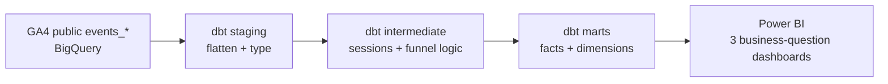

# GA4 eCommerce Analytics Engineering

BigQuery · dbt Core · BEAM dimensional modeling · Power BI

An end-to-end analytics engineering portfolio project that transforms nested Google Analytics 4 ecommerce events from the Google Merchandise Store public BigQuery dataset into documented, testable analytics marts for acquisition, funnel, and product analysis.

> **Project status:** the dbt implementation was recovered from an earlier project pass and is being re-validated end to end. Power BI will be rebuilt from scratch. Vanna AI is intentionally out of scope for this repository.

## Business problem

Raw GA4 exports are event-grain, nested, and difficult for non-technical users to query consistently. This project builds a reusable analytics layer so the same business questions can be answered from governed tables rather than ad-hoc SQL.

The model is anchored to three questions:

1. **Acquisition:** Which channels bring users, and which of those sessions convert?
2. **Funnel:** Where do users drop off between product view, cart, checkout, and purchase?
3. **Product:** Which products receive strong interest but weak purchase conversion?

## Architecture



### dbt layers

| Layer | Purpose | Materialization |
|---|---|---|
| `staging` | Flatten GA4 structs/arrays, rename fields, cast types | Views |
| `intermediate` | Reconstruct sessions, assign funnel steps, reuse join logic | Views |
| `marts` | Business-facing facts and dimensions | Tables |

## Dataset

Source: `bigquery-public-data.ga4_obfuscated_sample_ecommerce`

The public sample covers 2020-11-01 through 2021-01-31 and stores GA4 events in daily `events_YYYYMMDD` tables. Important repeated structures include `event_params` and `items`, so the staging layer performs the flattening needed for downstream analytics.

Raw data is **not** copied into this repository.

## Dimensional model

### Fact tables

| Model | Grain | Primary use |
|---|---|---|
| `fct_sessions` | one reconstructed session | acquisition + conversion |
| `fct_product_interactions` | one item per funnel event | funnel + product behavior |
| `fct_purchases` | one purchase transaction | revenue + transactions |

### Dimensions

`dim_users`, `dim_products`, `dim_date`, `dim_device`, `dim_traffic_source`

See [`docs/03_beam_and_data_model.md`](docs/03_beam_and_data_model.md) for the business-event design and model caveats.

## Repository structure

```text
.
├── models/
│   ├── staging/
│   ├── intermediate/
│   └── marts/
├── seeds/
├── analyses/
├── tests/
├── macros/
├── scripts/
├── dashboards/
│   └── screenshots/
├── docs/
├── dbt_project.yml
├── packages.yml
├── profiles.example.yml
├── requirements.txt
└── README.md
```

Generated folders (`target/`, `logs/`, `dbt_packages/`), local virtual environments, credentials, and Power BI binary files are intentionally excluded.

## Quick start

### 1. Create a virtual environment

**PowerShell**

```powershell
python -m venv .venv
.\.venv\Scripts\Activate.ps1
pip install -r requirements.txt
```

### 2. Configure dbt

Create your local dbt profile from `profiles.example.yml` and keep the real profile/credential file outside Git.

Set:

- `GCP_PROJECT_ID`
- `DBT_BIGQUERY_KEYFILE`

Then verify the connection:

```bash
dbt debug
```

### 3. Install packages and seed the date dimension

```bash
dbt deps
python scripts/generate_dim_date_seed.py
dbt seed
```

### 4. Build and test in development

The staging SQL contains a development date filter so the default `dev` target only scans a small slice of the public data.

```bash
dbt run
dbt test
```

### 5. Build production marts

After development validation passes:

```bash
dbt run --target prod
dbt test --target prod
```

### 6. Generate dbt documentation

```bash
dbt docs generate
dbt docs serve
```

## Power BI plan

The final portfolio version will contain three pages/reports aligned to the three business questions:

- Acquisition performance
- Purchase funnel
- Product performance

Screenshots and/or exported PDFs belong in `dashboards/screenshots/`. The `.pbix` is not committed by default because Power BI files can be large; use Git LFS or a published-report link if you decide to distribute it.

See [`docs/07_powerbi_rebuild_plan.md`](docs/07_powerbi_rebuild_plan.md).

## Data quality and validation

The dbt YAML files include `not_null`, `unique`, and `accepted_values` tests. Because this repository was reconstructed from an earlier local project, historical build artifacts are **not** treated as proof that the current code is fully validated. Run `dbt test` again and record final results before presenting findings as portfolio conclusions.

Known recovery items are documented in [`docs/08_revalidation_checklist.md`](docs/08_revalidation_checklist.md).

## Scope

Included:

- BigQuery public GA4 data
- BEAM / dimensional-model design
- dbt staging, intermediate, and mart layers
- dbt documentation and tests
- Power BI rebuild and screenshots

Not included:

- Vanna AI / conversational analytics
- Google service-account keys or any secrets
- Local Python virtual environments
- dbt generated artifacts
- Raw GA4 data extracts

## Acknowledgements

This is a portfolio implementation built from a guided learning project using Google's public GA4 ecommerce sample. Course/instructor material should be cited according to its terms and should not be copied into this repository verbatim. The repository should contain your implementation, explanations, and results.
