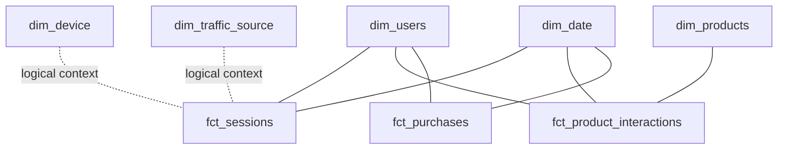

# BEAM and Dimensional Model

## Why design before SQL

The project uses Business Event Analysis & Modeling (BEAM) to start from business events and analytical questions rather than mirroring the source schema. The 7Ws prompt is used to identify actors, objects, time, context, reasons, measures, and classifications for each event.

## Modeled business events

### Session
Grain: one row per reconstructed session.

Purpose: channel volume, engagement, conversion, and session-level behavior.

### Product interaction
Grain: one item per ecommerce funnel event.

Covered events: `view_item`, `add_to_cart`, `begin_checkout`, `purchase`.

Purpose: funnel progression and product-level interest/conversion.

### Purchase
Grain: one completed transaction.

Purpose: order and revenue analysis without duplicating transaction-level revenue across item rows.

## Logical model

## Important implementation caveat

The recovered code stores several device and traffic attributes directly on facts, while `dim_device` and `dim_traffic_source` also exist as descriptive lookup tables. Before calling the model a fully keyed star schema in the final portfolio, validate whether you want to:

1. add surrogate `device_key` / `traffic_source_key` foreign keys to the facts, or
2. intentionally keep those attributes denormalized and describe the dimensions as supporting lookups.

Do not create a Power BI relationship on a non-unique column simply because the field names match.
